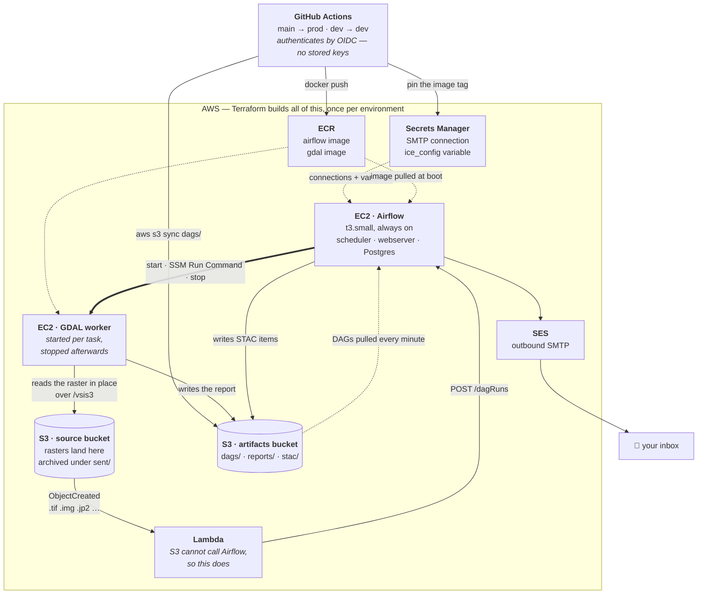
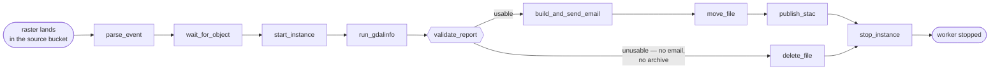

# ice

An **Apache Airflow** deployment on AWS, built end to end with Terraform and deployed
by GitHub Actions. It runs eight DAGs: one reacts to files landing in S3, the rest are
scheduled reports that arrive by email.

The idea in one line: **a raster lands in an S3 bucket, a container inspects it, and you
get an email about it.**

> **Status — not currently deployed.** The AWS environments were destroyed to stop the
> monthly spend, and `deploy.yml` only runs on `workflow_dispatch` so a push cannot
> rebuild them. The code is unchanged and accurate. See
> [docs/reference.md](docs/reference.md#rebuilding) before applying it again.

> **Placeholders.** Account IDs, bucket names and email addresses in this repository are
> examples (`123456789012`, `example-dem`, `sender@example.com`). Replace them in
> `infra/envs/*.tfvars`, `infra/versions.tf` and `infra/bootstrap/variables.tf` before
> deploying anything — and keep the replacements out of the repository if you fork it
> publicly. Nothing here is a credential: the FIRMS key and the deploy role ARN are
> supplied to CI out of band, and `.pre-commit-config.yaml` runs `gitleaks` so a real
> one cannot be committed by accident.

---

## The infrastructure

Two EC2 instances, and the second one is only running while it has work to do. Airflow
is always on; the GDAL worker is started by a task, driven over SSM, and stopped again —
so a heavy image-processing box is billed by the minute instead of by the month.



**Why a Lambda?** S3 event notifications can't call an Airflow REST endpoint. The Lambda
is the adapter — it turns an `ObjectCreated` event into a `POST /dagRuns` with a
deterministic run id, so the same upload never starts two runs.

**Why sync DAGs through S3?** GitHub Actions writes `dags/` to the artifacts bucket and
the Airflow box pulls it down on a one-minute timer. That keeps CI from needing SSH or a
network path into the VPC.

---

## The DAGs

| DAG | Trigger | What it does |
|---|---|---|
| `gdalinfo_notify` | S3 upload | Inspects the raster with GDAL, emails the metadata, archives the file, writes a STAC item. Deletes it instead if it's unusable. |
| `gdal_weather` | daily, 13:00 ET | Pulls the 12Z GFS run from NOAA, maps the next 24 hours of US rainfall, emails the map. |
| `fire` | daily, 08:00 ET | Fetches active wildfires from NASA FIRMS, charts them, emails the result. |
| `temperature` | daily, 08:00 ET | Tomorrow's forecast for the configured weather stations, one email per station. |
| `stock` | weekdays, 13:00 ET | The session's closing price and an intraday chart, one email per ticker. |
| `stac_publish` | daily | Rebuilds `collection.json` over every STAC item in the bucket. |
| `random_email` | daily | Smoke test — draws a number, emails it. Proves the SMTP path still works. |
| `random_numbers` | manual | Same idea, but one dynamically mapped task per number you pass at trigger time. |

Only the first two use the GDAL worker. The rest run entirely on the Airflow box.

```mermaid
flowchart TB
    subgraph B["<b>gdal_weather</b> — daily 13:00 ET · uses the worker"]
        direction LR
        b1[resolve_cycle] --> b2[wait_for_cycle] --> b3[start_instance] --> b4[run_weather_report] --> b5[build_and_send_email] --> b6[archive_grib] --> b7[stop_instance]
    end

    subgraph C["<b>fire</b> — daily 08:00 ET"]
        direction LR
        c1{{store_fires}} -->|"fires found"| c2[build_and_send_email]
        c1 -->|"none today"| c3[email_no_data]
    end

    subgraph D["<b>temperature</b> — daily 08:00 ET"]
        direction LR
        d1[draw_temperature] --> d2[build_and_send_email]
    end

    subgraph E["<b>stock</b> — weekdays 13:00 ET"]
        direction LR
        e1[draw_stock] --> e2[build_and_send_email]
    end

    subgraph F["<b>stac_publish</b> — daily"]
        direction LR
        f1[backfill_items] --> f2[write_collection]
    end

    subgraph G["<b>random_email</b> — daily smoke test"]
        direction LR
        g1[draw_num] --> g2[write_txt] --> g3{{check_num}}
        g3 -->|"even"| g4[even_num]
        g3 -->|"odd"| g5[odd_num]
        g4 --> g6[delete_txt]
        g5 --> g6
    end

    subgraph H["<b>random_numbers</b> — manual · one mapped task per number"]
        direction LR
        h1[get_nums] --> h2["get_num [ ]"] --> h3["write_txt [ ]"] --> h4{{"check_num [ ]"}}
        h4 -->|"even"| h5["even_num [ ]"]
        h4 -->|"odd"| h6["odd_num [ ]"]
        h5 --> h7["delete_txt [ ]"]
        h6 --> h7
    end
```



`{{ }}` marks a **branch** — exactly one of its downstream tasks runs and the other is
marked skipped. `[ ]` marks a **dynamically mapped** task: one copy per input, decided at
run time.

### `gdalinfo_notify` in detail

The one that reacts to uploads, and the only DAG that both starts and stops the worker:



Worth knowing about this graph:

- **`wait_for_object` runs before `start_instance`.** The worker is only booted once the
  raster is confirmed readable, so a bad event costs nothing.
- **`stop_instance` is `all_done`.** It runs even if everything upstream failed, and it
  joins both branches — the worker cannot be left running by a crash.
- **`publish_stac` runs after `move_file`**, so the STAC asset points at the archived key
  rather than one that is about to disappear.
- **Archiving to `sent/` in the same bucket** doesn't cause a loop: that prefix is
  filtered out of the S3 notification.

---

## Configuration

Runtime settings live in **Secrets Manager**, not in the DAG files — one JSON blob read
as an Airflow Variable called `ice_config` (bucket names, recipients, the stations and
tickers to report on), plus an `smtp_default` connection.

Terraform writes both. The DAGs read them by the same names in every environment; the
secrets *prefix* the scheduler is pointed at is the only thing that decides which set it
gets. That is what lets one DAG file be correct on both boxes.

---

## Two environments

Same code, same shapes, separate everything else. The branch you push decides which one
gets built — that mapping is written down exactly once, in `deploy.yml`.

| | prod | dev |
|---|---|---|
| Branch | `main` | `dev` |
| Resource prefix | `ice-` | `ice-dev-` |
| Secrets prefix | `airflow/` | `airflow-dev/` |
| VPC | `10.20.0.0/16` | `10.21.0.0/16` |
| Destroyable | no — Terraform refuses | yes |

Each environment owns its own source bucket, and that isn't a preference:
`aws_s3_bucket_notification` describes a bucket's *complete* notification config, so two
stacks pointed at one bucket would take turns deleting each other's triggers — silently.

---

## Layout

| Path | What |
|---|---|
| `dags/` | The eight DAGs, plus helpers for EC2/SSM, NOMADS, email rendering and STAC |
| `app/` | The GDAL container — `gdal_report.py` inspects a raster, `gfs_rain.py` maps a forecast |
| `docker/airflow/` | The Airflow image the box runs |
| `lambda/trigger_dag/` | S3 event → Airflow, dependency-free |
| `infra/` | Terraform for the whole stack — one root module, built twice |
| `infra/envs/`, `infra/backends/` | The per-environment variables and state keys |
| `infra/bootstrap/` | State bucket, GitHub OIDC provider, deploy role — run once by hand |
| `scripts/` | Helper scripts — `bootstrap.sh`, `smoke_test.sh`, `airflow_ui.sh`, `stac_ui.sh`, `shell.sh`, `put_file.sh` |
| `tests/` | 390 tests — DAG import and structure, the Lambda, email rendering, SSM commands, and guards against the two environments drifting into each other |
| `docs/reference.md` | The long version: design rationale, operating notes, cost, teardown and rebuild |

---

## Getting it running

You need an AWS account, the `gh` CLI, and Terraform (or OpenTofu) ≥ 1.11.

```bash
# 0. Install the hooks. They are what keeps the placeholders placeholders once
#    you start putting real values beside them.
pip install pre-commit && pre-commit install

# 1. Replace the placeholders first — see the note at the top of this file.

# 2. One-time: state bucket, GitHub OIDC provider, deploy role.
./scripts/bootstrap.sh

# 3. Arm CI. Without the role ARN, deploy.yml stops before it can spend anything.
gh variable set AWS_DEPLOY_ROLE_ARN --body "arn:aws:iam::<account>:role/ice-github-actions-deploy"
gh secret   set FIRE_KEY   # NASA FIRMS map key, for the fire DAG

# 4. Push. main builds prod, dev builds dev, anything else fails on purpose.
git push origin main

# 5. Verify SES. It starts in the sandbox, so both the sender and the
#    recipient must click a confirmation link before any mail is delivered.

# 6. Check it end to end — uploads a raster and watches the pipeline react.
./scripts/smoke_test.sh
```

The Airflow UI has no public ingress by default. Reach it over an SSM port-forward:

```bash
./scripts/airflow_ui.sh
```

Full walkthrough, including what to do when a step fails:
[docs/reference.md](docs/reference.md#setup).

---

## Working locally

```bash
cp local/.env.example local/.env   # then edit it — the copy is gitignored
python -m pytest tests             # 390 tests, no AWS needed
ruff check app dags lambda tests
```

The tests mock every boundary, so the whole suite runs offline in about 15 seconds.

---

## Reading more

[**docs/reference.md**](docs/reference.md) is the long-form version of this README: why
each piece is shaped the way it is, how the STAC catalogue and the rainfall forecast
work, operating notes, running costs, and the teardown/rebuild procedure.

---

## License

[MIT](LICENSE). The Terraform, the DAGs and the docs are all yours to reuse.
