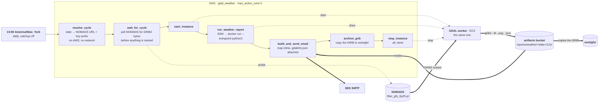

# ice — event-driven GDAL metadata pipeline

> **Status: torn down (2026-09-02).** Both AWS environments were destroyed to stop the
> monthly spend. The code is unchanged and still describes the stack accurately — what
> follows is how it works when deployed, not what is running today. Nothing is running
> today. `deploy.yml` no longer applies on push (`workflow_dispatch` only), so a push
> to `main` or `dev` will not rebuild it. See [Rebuilding](#rebuilding) before you
> apply either environment again — prod's two S3 buckets survived the teardown and
> must be re-adopted, and its SES identities need verifying a second time.

A raster lands in `s3://example-dem`, GDAL inspects it, an email with its metadata
arrives at `recipient@example.com`, the raster moves to `sent/` so the top of the
bucket is only ever what has not been processed yet, and a STAC item describing it is
written to the artifacts bucket. A raster the report shows to be unusable is deleted
instead, unreported and uncatalogued. Orchestrated with Airflow on one EC2 instance,
executed in a Docker container on a second one, deployed by GitHub Actions.

A second DAG rides on the same worker: once a day at 13:00 Eastern, `gdal_weather`
pulls the 12Z GFS run from NOAA, renders the next 24 hours of US rainfall as a map and
emails it. See [The daily rainfall forecast](#the-daily-rainfall-forecast).

It exists twice. `main` builds **prod**, `dev` builds **dev** — the same code, the
same shapes, its own bucket and its own boxes. See [Environments](#environments).

```mermaid
flowchart LR
    UP["raster lands in<br><b>s3://example-dem</b>"]
    LB["<b>Lambda</b> · ice-trigger-dag<br><i>S3 cannot call Airflow directly</i>"]
    AF{{"<b>Airflow</b><br><i>t3.small, docker compose</i>"}}

    subgraph dag["DAG · gdalinfo_notify · max_active_runs=1"]
        direction TB
        T1["<b>parse_event</b><br>validate the key from dag_run.conf"]
        T2["<b>wait_for_object</b><br>poll until the raster is readable<br><i>before anything is started</i>"]
        T3["<b>start_instance</b><br>EC2 start, then wait for SSM Online"]
        T4["<b>run_gdalinfo</b><br>SSM Run Command → docker run"]
        TV{"<b>validate_report</b><br><i>is the raster usable?</i>"}
        T5["<b>build_and_send_email</b><br>HTML summary, gdalinfo.json attached"]
        T6["<b>move_file</b><br>copy to sent/, then delete the original"]
        T8["<b>publish_stac</b><br>one STAC item<br><i>after the move — the asset<br>points at the archived key</i>"]
        TD["<b>delete_file</b><br><i>no email, no archive</i>"]
        T7["<b>stop_instance</b><br><i>all_done — runs even if the above failed,<br>and joins both branches</i>"]
        T1 --> T2 --> T3 --> T4 --> TV
        TV -->|yes| T5 --> T6 --> T8 --> T7
        TV -->|"no — the other branch is skipped"| TD --> T7
    end

    W["<b>GDAL worker</b> · EC2<br><i>normally stopped,<br>billed by the minute</i>"]
    ART[("<b>artifacts bucket</b><br>gdalinfo.json<br>summary.json")]
    ARCH[("<b>sent/</b><br><i>same bucket — the event<br>this makes is dropped</i>")]
    MAIL["<b>SES SMTP</b><br>email"]

    UP -->|"S3 event<br>suffix-filtered"| LB
    LB -->|"POST /dagRuns<br>basic auth, deterministic run id"| AF
    AF --> T1

    T3 -.->|start| W
    T4 -.->|drive| W
    T7 -.->|stop| W
    W ==>|"writes over /vsis3"| ART
    ART ==>|"reads summary.json"| TV
    ART ==>|reads| T5
    T5 ==> MAIL
    T6 ==>|"moves the raster"| ARCH
    T8 ==>|"writes stac/…/items/"| ART

    SP["<b>DAG</b> · stac_publish<br><i>daily, or on demand</i>"]
    ART <==>|"backfills items,<br>rewrites collection.json"| SP
```



Dotted edges are control of the worker; thick edges are where the data goes. The
worker is a separate box from Airflow and is powered off between runs.

## Why it is shaped this way

**S3 cannot call Airflow directly.** Its only notification targets are SNS, SQS,
Lambda and EventBridge. EventBridge API Destinations speak basic auth natively and
could replace the Lambda outright — but they call from AWS's own network, so they
need Airflow on a public HTTPS endpoint, meaning a domain and a certificate for the
box. That is a worse trade than a 60-line function for a pipeline this size, and it
is the obvious simplification the day a domain exists. The function joins the VPC and
POSTs to Airflow's private address; it has no dependencies, not even boto3.

**Airflow is one EC2 instance, not MWAA.** The smallest MWAA environment is ~$120/mo
and it refuses to run anywhere but private subnets — which would mean a NAT gateway
at another ~$35/mo purely to give those subnets a route out. A `t3.small` running
docker compose does the same job for ~$16, and puts both instances in a public subnet
with **no inbound rules at all**. SSM Run Command reaches them over a connection the
agent opens outbound, so nothing about that is less closed than a private subnet
would have been. What is genuinely given up is availability: one instance, one root
volume, and a scheduler that is down while it reboots. The work is idempotent and the
trigger is a durable S3 event, so a run that arrives during a reboot is late rather
than lost.

**The worker is normally stopped.** The DAG starts it, runs one container, and stops
it again, so EC2 is billed by the minute. `max_active_runs=1` is a correctness
constraint that follows from this, not a tuning knob — two concurrent runs sharing
one start/stop worker means one run's `stop_instance` can kill the other's
`gdalinfo` mid-flight. Bursts queue and process one at a time.

**The object is waited for before the worker is started, not after.** `wait_for_object`
polls S3's `object_exists` waiter for up to `object_timeout` seconds (60 by default,
in `ice_config`) and only then does `start_instance` run. The event says an object was
created; it does not guarantee the key is readable by the time Airflow gets to it, and
a missing one should cost a task failure rather than a booted EC2 instance waiting to
be stopped again. It uses the boto3 waiter directly rather than `S3KeySensor` — the
amazon provider is installed either way, but every other task here is a
`PythonOperator`, and at a 60-second ceiling a deferrable sensor's freed worker slot
buys nothing.

**Reports go to a different bucket than the trigger.** Writing outputs back into
`example-dem` is how you get a notification loop.

**The archive is the deliberate exception to that**, and it costs something. A
processed raster is still an input, not an output, so it stays in the source bucket
under `sent/` rather than being mixed into the artifacts bucket — but that means
`move_file`'s copy lands in the very bucket the pipeline watches, and
`aws_s3_bucket_notification` filters on suffix with no way to express *not* this
prefix. The archived copy therefore does fire an `ObjectCreated` event, and what
stops that becoming a second run is the trigger Lambda dropping keys under
`ARCHIVE_PREFIX`. Three places have to agree on that string: `local.archive_prefix`
in `infra/versions.tf`, which reaches both the Lambda's environment and the IAM
statement that permits the write, and `ARCHIVE_PREFIX` in the DAG. If they ever
diverge the symptom is not an error — it is either every raster processed and
emailed twice, or an `AccessDenied` on the archive write.
`tests/test_archive_wiring.py` fails if the three drift apart.

**The archive moves rather than copies, and deletes only after the copy returns.**
A failed copy leaves the raster where it was, which is the recoverable direction to
fail in; deleting first would turn a transient S3 error into an object that exists
nowhere. `tests/test_dag_tasks.py` pins that ordering.

**An unusable raster is deleted rather than reported on**, and the distinction the
DAG draws is between *broken* and *useless*. `validate_report` reads `summary.json`
and asks three questions of it: are there any bands, does the CRS carry an EPSG code,
did every band fail its statistics. A report that cannot be read at all is broken —
the task raises, the failure email goes out, and nothing is deleted. A report that
reads cleanly but describes a raster nobody can use is not an error, so the run stays
green, takes the delete branch, and the object is removed without an email. What
survives is the evidence: `gdalinfo.json` and `summary.json` are written before the
branch is chosen and stay in the artifacts bucket, so there is always a record of why
an object went away. The delete is final — the source buckets are adopted and
unversioned — and `delete_file` therefore refuses any key already under `sent/`, so a
re-run cannot be what destroys an archive that passed validation once.

**It is a branch and not a `ShortCircuitOperator`**, which is a sharper distinction
than it looks. `BranchPythonOperator` marks only the direct downstream it did not
pick as skipped and leaves everything past that to ordinary trigger rules — so
`move_file` skips naturally along with the email, and `stop_instance`'s `all_done`
counts the skipped branch as done and stops the worker. `ShortCircuitOperator`'s
default, `ignore_downstream_trigger_rules=True`, instead writes `SKIPPED` directly
onto *every* descendant without consulting a trigger rule at all. That reaches past
`move_file` to `stop_instance`, whose `all_done` never gets evaluated — and the
symptom is not a failed run but a green one with an EC2 instance still billing.

**The `crs.epsg` check is the debatable one.** `describe_crs` in `app/gdal_report.py`
leaves `epsg` null for a valid *custom* projection too, because GDAL's
`AutoIdentifyEPSG` only sets an authority when it is confident, so this rejects a
raster that is unconventional rather than unusable. Testing `crs["name"]` instead is
the looser reading — no CRS at all rather than no EPSG code — and is a one-line
change in `validate_report` with the parametrised tests alongside it.

**gdalinfo output goes to S3, not through SSM.** Run Command truncates its response
at ~24 KB, which `gdalinfo -json` exceeds on a multi-band raster.

## Environments

Two of them, from one root module and one branch each:

| | prod | dev |
|---|---|---|
| Branch | `main` | `dev` |
| Resource prefix | `ice-` | `ice-dev-` |
| Watches | `s3://example-dem` (pre-existing, adopted) | `s3://example-dem-dev` (pre-existing, adopted) |
| Artifacts | `ice-artifacts-123456789012` | `ice-dev-artifacts-123456789012` |
| Images | `ice/gdal-report`, `ice/airflow` | `ice-dev/gdal-report`, `ice-dev/airflow` |
| Airflow config | `airflow/{connections,variables}/*` | `airflow-dev/{connections,variables}/*` |
| VPC | `10.20.0.0/16` | `10.21.0.0/16` |
| Mail | `recipient@example.com` | the same address |
| State | `s3://ice-tfstate-123456789012/ice/terraform.tfstate` | `.../ice/dev/terraform.tfstate` |
| Destroyable | no — `force_destroy_buckets` is refused for prod | yes |

Everything else is identical on purpose. Same instance types, same tuning, same
retention, same DAG, same image build. A dev environment that differs in those is
not rehearsing the deploy that matters.

**Each environment owns its own source bucket, and that is not a preference.**
`aws_s3_bucket_notification` describes a bucket's *complete* notification
configuration rather than contributing a rule to it. Two stacks pointed at one
bucket would therefore take turns deleting each other's triggers, and the symptom is
not an error — it is prod uploads silently producing nothing, hours after whichever
`apply` ran last. Separate buckets make that structurally impossible.

**Both source buckets are adopted rather than created.** Each existed before this
stack described it — `example-dem` predates the project, `example-dem-dev` was
made by hand the day dev was written — and S3's `CreateBucket` is not idempotent for
a name you already own, so an apply that tried to create either would fail with
`BucketAlreadyOwnedByYou`. The `import` block in `infra/import.tf` reconciles that
once; after the first apply it does nothing.

Prod's was a `data` lookup until recently, which meant the stack could name
`example-dem` but say nothing about its configuration — encryption, public access
and the rest were whatever the console last left there, and drift on the bucket the
whole pipeline depends on was invisible to `terraform plan`. Managing it closes that.
**What it costs is that `terraform destroy` can now reach the bucket**, where before
it structurally could not. The only thing standing in the way is
`force_destroy = false`, which stops a destroy on a bucket holding objects — the same
catch the artifacts bucket has always had, and a weaker guarantee than the lookup
was. An *empty* prod source bucket is now destroyable.

**dev expires its rasters after 30 days and prod expires nothing**, which is the one
place the two source buckets are configured differently. The rule is gated on
`source_bucket_expiry_days` rather than on which environment owns the bucket, because
those are not the same question and conflating them is how prod's `sent/` archive
would end up on a deletion timer. Prod passes `null`, which removes the rule outright
rather than setting a long retention; the variable's own validation refuses any other
value when `env` is `prod`.

**Both environments send from and to the same addresses**, so a dev run reports into
the ordinary inbox and there is nothing to verify before dev can send. `var.env` is
not in the headers, and the subject is built from the raster's filename in both, so
**a dev report is not distinguishable from a real one at a glance** — the bucket
named in the report body is the tell. If that becomes a problem, the fix is to put
the environment in the subject line rather than to split the addresses.

**SES identities are account-global**, which is why `ses_identities` lists the
addresses a stack *creates* rather than the ones it may use. Prod creates both; dev
creates none and relies on them being verified, which is all SES checks. The
dependency runs one way: destroying prod's identities would stop dev sending, and a
`terraform destroy` of dev touches neither.

**Which environment an apply builds is never inferred.** `var.env` has no default,
the backend key is not in `versions.tf`, and CI derives both the tfvars and the state
key from the branch name in a single step. By hand it is two flags that must agree:

```bash
cd infra
terraform init -reconfigure -backend-config=backends/dev.hcl
terraform plan -var-file=envs/dev.tfvars
terraform output -raw env      # dev — worth checking before an apply
```

`-reconfigure` matters when switching: without it, `init` keeps the backend the
working directory was last initialised with.

**What the environments still share**, and why each is deliberate: one AWS account
(there is only one), one Terraform state bucket (the lock is per key, so applies do
not block each other), one GitHub OIDC deploy role, and the account's SES sandbox
quota of 200 messages a day. The role is the one worth naming — it holds
`AdministratorAccess` and any branch can assume it, so **dev's blast radius is the
whole account, not just dev's resources**. A second, resource-scoped role per
environment is the fix; it is a real piece of work, and the honest note in
`infra/bootstrap/main.tf` about why the policy is admin in the first place applies
just as much to the second copy.

## Layout

| Path | What |
|---|---|
| `app/` | GDAL container, two entry points — `gdal_report.py` inspects a raster over `/vsis3`, `gfs_rain.py` fetches and maps a GFS forecast |
| `dags/` | `gdalinfo_notify`, `stac_publish` and `gdal_weather` DAGs, plus EC2/SSM, NOMADS, email-rendering and STAC helpers |
| `lambda/trigger_dag/` | S3 event → Airflow, dependency-free |
| `infra/` | Terraform for the whole stack — one root module, built twice |
| `infra/envs/` | `prod.tfvars`, `dev.tfvars` — everything that differs between the two |
| `infra/backends/` | `prod.hcl`, `dev.hcl` — the state key each one initialises against |
| `infra/airflow_ec2.tf` | The Airflow box: instance, identity, UI password |
| `infra/airflow_compose.yml` | What that instance actually runs, verbatim |
| `infra/bootstrap/` | State bucket, GitHub OIDC provider, deploy role — run once by hand, shared by both |
| `scripts/` | `bootstrap.sh`, `smoke_test.sh`, `airflow_ui.sh`, `stac_ui.sh` |
| `tests/` | DAG import and structure checks, unit tests for the Lambda, the email rendering and the SSM command construction, plus the environment-isolation guards |

## The Airflow box

A `t3.small` running Airflow 2.10.3 under docker compose with a LocalExecutor and a
Postgres container. It syncs `dags/` down from the artifacts bucket every minute —
which is how the deploy workflow reaches it without a second deployment mechanism.

It is tuned rather than sized up. Untuned it boots fine and looks healthy at rest,
then wedges under an actual DAG run — twice it pinned the CPU and stopped answering
SSM altogether, which presents as a network fault rather than as a starved box. A
2 GiB swapfile, two gunicorn workers instead of four and one scheduler parsing
process instead of two fix it; a full run now completes with swap barely touched.

Sizing up was not available. This is a Free plan account, so `t3.medium` cannot be
launched at all and the next eligible step up is `c7i-flex.large` — 4 GiB for ~$66/mo
against t3.small's 2 GiB for ~$16. See the `airflow_instance_type` variable for the
eligible types and prices; if the box ever does misbehave, that type is the answer
and it needs no other change.

There are two of them, one per environment, and they are the bulk of what the second
environment costs.

The UI needs no public ingress — reach it over SSM. `scripts/airflow_ui.sh` is the
way in; it holds the terminal open for as long as the forward lives, and Ctrl-C
ends it.

```bash
./scripts/airflow_ui.sh              # dev, the default
./scripts/airflow_ui.sh prod         # the live one
./scripts/airflow_ui.sh dev 8090     # somewhere other than this env's usual port
```

It re-initialises the backend for the environment you asked for, checks the state
file agrees before going near a box, starts that box if it is stopped — asking
first, because it bills — prints the admin login, and opens the browser on the
DAG's graph view once the forward is actually accepting connections.

Both boxes serve on `8080` and nothing on the page says which one you are looking
at, so the script gives them different local ports: **prod is `localhost:8080`, dev
is `localhost:8081`**. That is the only thing worth memorising about it.

By hand, if the script is not what you want — which box you get depends on which
backend the working directory was last initialised against, so the flags matter:

```bash
terraform -chdir=infra init -reconfigure -backend-config=backends/dev.hcl

aws ssm start-session --target "$(terraform -chdir=infra output -raw airflow_instance_id)" \
  --document-name AWS-StartPortForwardingSession \
  --parameters '{"portNumber":["8080"],"localPortNumber":["8080"]}'
# password: aws secretsmanager get-secret-value \
#             --secret-id "$(terraform -chdir=infra output -raw airflow_admin_secret)"
```

## The STAC catalogue

Every raster that passes validation gets a [STAC](https://stacspec.org) item, written
as static JSON into the artifacts bucket:

```
stac/
  catalog.json
  elevation/
    collection.json
    items/<item_id>.json
```

Two DAGs share the work, and the split is the design rather than an accident.
`gdalinfo_notify` writes **one item per raster** and stops there. `stac_publish`
rewrites the **collection** — whose extent is the union of every item's and whose link
list names all of them — on a daily schedule and on demand.

The collection is a document that grows with every raster ever processed. Rewriting it
on the upload path would put a read-modify-write of unbounded size between an upload
and its email. The cost of keeping it off that path is staleness: an item written a
minute ago is on S3 but not yet listed in the collection. Trigger `stac_publish` if
that matters now rather than tomorrow.

`stac_publish` also backfills. Point it at an environment whose archive predates the
catalogue and it will write an item for every report under `reports/` that does not
have one — skipping the ones whose raster was deleted for being unusable, which is
what a report with no object behind it means.

**S3 is the source of truth, deliberately.** Nothing here needs a database, and
anything that later serves this catalogue over HTTP — pgSTAC, stac-fastapi, a static
browser — should be a rebuildable index over these files rather than the only copy.
The Airflow box replaces itself on any change to `airflow_compose.yml`, taking its
volumes with it.

Some things worth knowing about the items:

- **`datetime` is the processing time**, not an acquisition time — nothing upstream
  carries one. `ice:datetime_source` records that, so filtering these items by
  datetime is knowingly filtering by processing order.
- **Asset hrefs are `s3://`.** The buckets block public access, so there is no URL a
  reader can fetch anonymously; a `https://` href would be a link that looked public
  and returned 403.
- **Band statistics are approximate.** `gdal_report.py` computes them over a sample,
  and each band carries `ice:statistics_are_approximate` to say so.
- **Item ids survive the archive move.** They are derived from the key with the `sent/`
  prefix stripped, so a re-run against an already-archived raster overwrites its item
  rather than minting a second one.

The mapping lives in `dags/common/stac.py` and is pure — no Airflow, no boto3 — which
is what lets `tests/test_stac.py` exercise all of it from a fixture. It builds plain
dictionaries rather than using pystac, which stays a test-only dependency: it
validates the output against the published schemas in CI — the stricter check — and
nothing at run time needs a second STAC implementation shipped to the box to write
plain dicts.

### Looking at it

```bash
./scripts/stac_ui.sh              # dev, the default
./scripts/stac_ui.sh prod         # the live one
```

That syncs the `stac/` prefix into `local/stac/<env>/` and serves it to
[STAC Browser](https://github.com/radiantearth/stac-browser) on `localhost:8085`
(dev) or `8084` (prod) — the same "lower number is prod" convention `airflow_ui.sh`
uses. Ctrl-C stops it.

STAC Browser is a single-page app that runs in *your* browser, so it can only read
the catalogue over HTTP. The script serves the copied tree out of the browser
image's own web root, which makes the app and the JSON one origin: no CORS
configuration on the bucket, and nothing has to become reachable from the internet
in order to be looked at. **Nothing here is deployed** — no AWS resource, no cost,
and the script only ever reads. S3 stays the source of truth and `local/stac/` is a
disposable mirror, re-synced (with `--delete`) on every run.

Two things follow from choices made further up:

- **Assets are listed but not fetchable.** Their hrefs are `s3://`, so the page can
  show them and their types and cannot download them. Metadata, geometry, projection
  and band statistics all render.
- **A blank catalogue means `stac_publish` has never run.** Items alone are not a
  tree; `catalog.json` and `collection.json` are what makes one. The script checks
  for the root and says so rather than serving a blank page.

## The daily rainfall forecast

A second DAG, `gdal_weather`, runs at **13:00 America/New_York** and emails a map of
the rain the US is expected to get over the following 24 hours. It shares the worker
and the container image with the elevation pipeline and nothing else — no S3 event, no
Lambda, no catalogue.



### Which forecast, exactly

GFS runs four times a day — 00Z, 06Z, 12Z, 18Z. This uses the **12Z** cycle at
**forecast hour 024**, so the map covers 12Z today through 12Z tomorrow: 08:00 to 08:00
Eastern. The 12Z products are published well before 13:00 Eastern, which is what makes
a single daily run at a fixed local wall time work without a retry loop around it.

The URL is a NOMADS *grib filter* request, not a file path — the CGI subsets a global
GRIB2 file server-side, which is why the download is 62 KB rather than 500 MB.
`dags/common/gfs.py` builds it, and builds it once: the URL `wait_for_cycle` probes is
passed to the container as `--url`, so there is no second construction of it to drift.

**The band is chosen by its accumulation window, never by position.** An f024 file
contains two APCP records that share a valid time and a level:

| Band | `GRIB_ELEMENT` | Window | |
|---|---|---|---|
| 1 | `APCP06` | 18–24 h | only the last six hours |
| 2 | `APCP24` | 0–24 h | the full 24-hour total |

The six-hour bucket comes **first**, so anything that defaults to band 1 — including
`gdaldem color-relief` run straight on the GRIB — renders a perfectly plausible map of
the wrong period. `gfs_rain.py` derives each band's window from
`GRIB_VALID_TIME − GRIB_REF_TIME − GRIB_FORECAST_SECONDS` and raises if none matches,
rather than falling back.

### What it writes

```
s3://<artifacts>/reports/weather/2026-08-20/12z/
    usa_rain.grib2      what NOMADS served, untouched
    usa_rain.tif        band 2 alone, tagged EPSG:4326
    usa_rain.png        that band through the rainfall ramp
    gdalinfo.json
    summary.json

s3://<source>/sent/gfs/
    usa_rain_2026-08-20_12z.grib2
```

Only the GRIB is archived. The GeoTIFF and the PNG are renderings, reproducible from
those bytes; the GRIB is the part that cannot be fetched again once NOMADS ages the
cycle off its ~10-day window. The copy is done by the scheduler rather than the worker
because the scheduler already has `PutObject` scoped to `sent/*` and the worker may
only write under `reports/`. Landing in `sent/` is safe: the trigger Lambda drops every
key under that prefix.

The GeoTIFF is tagged `EPSG:4326` on the way out. GDAL reads the GRIB's own CRS as a
bare geographic system on a 6371229 m sphere with no authority code — `AutoIdentifyEPSG`
raises `Unsupported SRS` on it — which leaves the product unusable in anything that
wants an EPSG. Coordinates are unchanged; only the label is, and the original WKT is
kept in `summary.json`.

### Re-running one

```bash
# today's 12Z run
airflow dags trigger gdal_weather

# a specific cycle — NOMADS keeps about ten days
airflow dags trigger gdal_weather --conf '{"date": "20260813", "cycle": "06"}'
```

Products are keyed by cycle date, so a re-run overwrites what it wrote last time
rather than accumulating a second copy. `accumulation` and `fhour` are overridable the
same way, and the email describes itself from the GRIB rather than from those values,
so it stays honest if you change them.

### Where it can collide

`max_active_runs=1` only serialises `gdal_weather` with itself. An upload arriving
while this run holds the worker gives `gdalinfo_notify` a run of its own, and whichever
finishes first stops the shared instance under the other. The idle alarm in
`infra/ec2.tf` catches the resulting orphan and the loser retries its SSM command. Once
a day at 13:00 against an event-driven pipeline, that overlap was judged rare enough to
accept rather than build a lock for.

## Setup

### 0. Account and credentials

**This is a Free plan account, and it fences off EC2 operations by name.**
`RunInstances` refuses any instance type that is not free-tier eligible, and
`ModifyInstanceAttribute` returns `FreeTierRestrictionError: This operation is not
available for free plan accounts`. That is what pins Airflow to a tuned `t3.small`.
The same plan appears to be why MWAA, EMR, Kinesis and MSK all answer
`SubscriptionRequiredException` on this account while everything this stack actually
uses answers normally — untested, since nothing here needs them any more.

**Credentials.** Every command below assumes the `ice-admin` IAM user. Terraform
reads credentials through the AWS SDK rather than the CLI's cache, so an `aws login`
browser session is invisible to it and `terraform apply` fails outright with `No
valid credential sources found`, whatever else is going on:

```bash
export AWS_PROFILE=ice-admin
aws sts get-caller-identity   # ...:user/ice-admin, not :root
```

It holds `AdministratorAccess` and a long-lived access key, so **attach an MFA device
to it** and rotate the key periodically. CI never uses it — GitHub Actions assumes
`ice-github-actions-deploy` through OIDC instead, with no stored secret.

None of this blocks local development of the container — see
[Working locally](#working-locally).

### 1. Bootstrap — already applied

The state bucket, the GitHub OIDC provider and the deploy role exist:

```
state bucket : ice-tfstate-123456789012   (matches the backend in infra/versions.tf)
deploy role  : arn:aws:iam::123456789012:role/ice-github-actions-deploy
```

Both are shared by the two environments. The bucket holds one state file per key —
`ice/terraform.tfstate` and `ice/dev/terraform.tfstate` — and the lock is per key, so
a dev apply and a prod apply never wait on each other. The `key` is deliberately
absent from the backend block in `infra/versions.tf`; it comes from
`infra/backends/<env>.hcl` at `init` time, so there is no environment an apply falls
back to.

The role's trust policy names the three subjects that actually assume it —
`ref:refs/heads/main`, `ref:refs/heads/dev` and `pull_request` — rather than ending in
a `:*` that matches every subject the repository can produce. Adding a third
environment therefore *does* need a bootstrap change now: one entry in
`local.oidc_subjects`, and the apply that follows.

That is the trade, and it is worth stating what it buys and what it does not. It rules
out tag refs, `environment:` subjects, and any workflow triggered by a push to a branch
other than those two. It does not rule out a pull request, because `pr.yml` plans
against real state and needs the role to do it — so anyone who can open a PR from a
branch *in this repository* can reach a role holding `AdministratorAccess`. Forks
cannot: a fork's token carries the fork's own `sub` and matches nothing here. In a
public repository that makes write access, not read access, the thing to keep narrow.
Removing the `pull_request` entry closes it at the cost of the plan on every PR.

`./scripts/bootstrap.sh` is idempotent, so re-running it is safe and will report no
changes. Run it from a real terminal — it prompts, and will hang if its input is
piped.

**The deploy role's trust policy accepts two subject formats**, and it has to. GitHub
now issues the OIDC subject with immutable numeric IDs appended to the owner and
repository names:

```
repo:your-org@1234567/ice@12345678:ref:refs/heads/main
```

Matching only the classic `repo:your-org/ice:ref:refs/heads/main` fails with `Not
authorized to perform sts:AssumeRoleWithWebIdentity` — which reads as a missing permission rather than a
claim that did not match, and is why the role, the provider, the audience and the
repository name can all look correct while every deploy fails.

### 2. Deploy — armed, and running

**This is deployed and green.** A push applies Terraform, builds and pushes both
images — the GDAL worker's and Airflow's own — pins each to that exact SHA, and syncs
`dags/` to S3. A run is a few minutes, most of it the image builds.

Nothing is built on either box. Both pull a tag named by a Secrets Manager pointer
that CI rewrites, which is what makes "what is running?" a question with an answer
and a rollback a matter of re-running an older workflow.

The branch decides which environment gets it:

| Push to | Builds | State key |
|---|---|---|
| `main` | prod | `ice/terraform.tfstate` |
| `dev` | dev | `ice/dev/terraform.tfstate` |
| anything else | nothing — the workflow fails at its first step rather than guessing | |

That mapping is written down once, in `deploy.yml`'s "Select the environment" step,
and the tfvars file and the backend key are both derived from it. The pair that must
never be mismatched is therefore never chosen twice. After the apply, the workflow
compares `terraform output env` against the branch it thinks it is deploying and
stops before pushing an image if they disagree.

`pr.yml` plans against the branch a PR would merge *into*, so a PR into `main` shows
prod's plan and the same change opened against `dev` shows dev's. The environment is
in the plan comment's heading.

**The comment carries the counts, not the plan.** A plan body names the account, the
buckets, the ARNs and the instance ids of a live stack, and in a public repository a
PR comment is the most readable place that text could possibly sit. So the comment is
`Plan: N to add, N to change, N to destroy` and a link; the full plan stays in the
workflow log, where the reviewer who needs it can open it. The job is also skipped
outright for a PR from a fork — a fork gets no OIDC token and no secrets, so every
step would fail on credentials rather than on the change, which tells a first-time
contributor nothing except that they cannot fix it.

The repository variable that arms it — one variable, both environments:

```bash
gh variable set AWS_DEPLOY_ROLE_ARN \
  --body "arn:aws:iam::123456789012:role/ice-github-actions-deploy"
```

`AWS_DEPLOY_ROLE_ARN` is the safety catch. Unset, `deploy.yml` fails at its
"Authenticate to AWS" step and skips everything after, so a push can neither build nor
spend. Unsetting it is the way to stop automatic deploys without touching the
workflow — it stops **both** environments, since they share the variable:

```bash
gh variable delete AWS_DEPLOY_ROLE_ARN
```

### 3. Verify SES

SES is in the sandbox on this account (200 messages/day, 1/second) so **both** the
sender and the recipient must be verified. Terraform creates the identities; the
links still have to be clicked:

```bash
for addr in sender@example.com recipient@example.com; do
  printf '%-32s %s\n' "$addr" \
    "$(aws sesv2 get-email-identity --email-identity "$addr" \
         --query VerifiedForSendingStatus --output text 2>/dev/null || echo absent)"
done
```

Both are already verified and both environments use them, so **dev needs no SES step
at all** — it inherits prod's verified identities. Only prod creates them, because a
second stack declaring the same address fails on apply. Until both return `true`,
SES accepts nothing from either environment.

The sandbox's 200 messages a day is now shared between the two. At one mail per
raster that is not a limit either of them will reach.

### 4. Smoke test

Defaults to dev, which is the point of having it:

```bash
./scripts/smoke_test.sh ~/ice/LE07_L1TP_201046_20240107_20240202_02_T1_VZA.TIF
./scripts/smoke_test.sh ~/ice/LE07_...TIF prod    # the live one, deliberately
```

It re-initialises the working directory against the environment it was given and
refuses to upload if `terraform output env` disagrees, so it cannot put a test raster
in prod's bucket by inheriting whatever `init` ran last.

## Working locally

The container needs no AWS access at all, which makes iterating on the email layout
fast:

```bash
docker build -t ice/gdal-report app/
docker run --rm -v "$PWD:/data" ice/gdal-report --local /data/some.tif > summary.json
```

Progress goes to stderr and the summary to stdout, so that redirect gives you the
same `summary.json` the pipeline would have written to S3. Rendering the email body
from it, without sending anything:

```python
import json
from dags.common.email_render import render, subject
summary = json.load(open("summary.json"))
open("/tmp/preview.html", "w").write(render(summary))
```

## Operating notes

**Which environment am I looking at?** Every resource name carries it — prod's are
`ice-*` and dev's are `ice-dev-*` — and so does the `Env` tag on all of them. The
working directory's answer is `terraform -chdir=infra output -raw env`, which
reflects the last `init`, not the last `apply`.

**Where to look when an upload produces nothing.** In order: the trigger Lambda's
log group (`/aws/lambda/ice-trigger-dag`, or `ice-dev-trigger-dag`), then the Airflow
UI for a queued or failed run, then the SSM command output in
`/aws/ssm/ice-gdal-worker`.

**Which environment sent that email?** Nothing in the headers says — both send from
and to the same addresses. The report body names the bucket the raster came from,
and `example-dem-dev` is dev's.

**A run that emails nothing** and shows no error in the DAG is usually SES:
`notify_failure` sends through the same SMTP connection as the report, so a send
failure is precisely the failure that cannot report itself. The task log on that
environment's Airflow box is the only place it appears.

**A raster that disappeared without an email** is `validate_report` taking the delete
branch, and it is a *successful* run rather than a failed one — so nothing is sent
and the only signal is the `WARNING` in that task's log, which names the reasons it
rejected the raster. The reports outlive the object: `summary.json` under the report
prefix in the artifacts bucket is what it judged. If a good raster was rejected, the
`crs.epsg` check is the first suspect.

**A raster that was reported on but is still at the top of the bucket** means
`move_file` failed after the email went out — the order of the tasks makes that the
survivable half of the run. The task is idempotent, so clearing it in the Airflow UI
is the whole fix; re-running the DAG from the start would send a second email.

**Two emails for one upload** is the archive loop: the copy into `sent/` produced an
event the trigger Lambda forwarded instead of dropping. Check `ARCHIVE_PREFIX` in the
Lambda's environment against the constant in the DAG — the second run is a real run,
so it appears in the UI with a key already under `sent/`.

**`move_file` needs more than read access to the source bucket.** The Airflow
instance role reaches it for `s3:GetObject`, `s3:DeleteObject` and — under `sent/`
only — `s3:PutObject`, in `infra/airflow_ec2.tf`. With only the artifacts-bucket
grant the task fails on the copy with `AccessDenied`, after the report has already
been sent, so the run looks half-successful: email delivered, raster still at the
top of the bucket.

**A stranded worker.** If a DAG run is killed between `start_instance` and
`stop_instance`, nothing in Airflow will stop the box. A CloudWatch alarm stops it
after 30 minutes below 5% CPU, so the exposure is bounded at half an hour rather
than indefinite.

**Changing `docker/airflow/requirements.txt`** ships as a new image: CI builds it,
pushes it to this environment's ECR repository under the commit SHA, and rewrites the
`<env>/airflow-image` secret. The box polls that secret every minute and pulls what it
names, so a dependency change lands in about as long as a DAG change and costs neither
the instance nor the Airflow database.

It did not always work that way. The box used to build its own image at first boot
from a copy of the requirements fetched out of S3, and nothing rebuilt it afterwards —
so a dependency added to the repository reached the box only if someone happened to
replace the instance. `sgo.py` shipped to dev importing `yfinance`, the S3 object
updated, the image did not, and the DAG failed to parse with the package sitting in
the repository. The constraint URL inside that file still has to match the Airflow and
Python version installing it, which is why it, the `FROM` line in
`docker/airflow/Dockerfile` and `var.airflow_version` are all on 2.10.3 / 3.11.

**Adding a raster extension** means adding it to `var.raster_suffixes` (S3 filters
are case-sensitive with no wildcards, so `.tif` and `.TIF` are separate rules) and
to `ALLOWED_SUFFIXES` in the Lambda environment and the DAG.

**Adding a third environment** is a tfvars file, a backend config, a branch in
`deploy.yml`'s mapping step, and an entry in `ENVIRONMENTS` in
`tests/test_env_isolation.py`. The `env` variable's validation lists the accepted
values and will reject the new one until it is added there too — deliberately, so
the four other places cannot be forgotten quietly.

**Tearing dev down** costs nothing to redo and is the honest way to pause its bill:

```bash
cd infra
terraform init -reconfigure -backend-config=backends/dev.hcl
terraform output -raw env      # dev. Check this. It is the whole safety mechanism.
terraform destroy -var-file=envs/dev.tfvars
```

`force_destroy_buckets = true` in dev's tfvars is what lets that finish rather than
stop at a bucket holding last week's test rasters. Prod's variable validation refuses
the same setting, so the equivalent command against prod's state stops at the
artifacts bucket instead of emptying it. Recreating dev is one push to the branch,
with no SES step — dev creates no identities, so a destroy takes none with it.

## Cost

Per environment:

| Item | Monthly |
|---|---|
| Airflow instance (`t3.small`, always on) | ~$16 |
| Airflow root volume | ~$2 |
| GDAL worker, started per run | cents, plus ~$2 for the idle root volume |
| S3 / ECR / Lambda / SES / CloudWatch | a few dollars |
| **Per environment** | **~$20** |
| **Both** | **~$40** |

The second environment costs very nearly what the first does, because the expensive
part is an instance that bills by the hour whether or not a raster ever arrives.
Nothing about the dev stack is sized down — that was the deliberate choice, and this
is its price.

Airflow is therefore always the thing to switch off first, and dev's is the first of
the two. Stopping the instance is cheaper than destroying it — that keeps the volume
and its image cache, so starting it again is a boot rather than a rebuild:

```bash
terraform -chdir=infra init -reconfigure -backend-config=backends/dev.hcl
aws ec2 stop-instances --instance-ids "$(terraform -chdir=infra output -raw airflow_instance_id)"
```

That leaves ~$4/month of volumes for a dev environment that is otherwise off. Nothing
will trigger while it is stopped — the Lambda's POST fails and the upload is lost, not
queued. Start it again before uploading.

## Rebuilding

Both environments were destroyed on 2026-09-02 to stop the spend. The code was not
changed to do it — everything above still describes what an `apply` builds. What
follows is only the difference between this repository and a clean slate.

**What survived the teardown:**

| | |
|---|---|
| `s3://example-dem` | prod's rasters and the `sent/` archive, 16 objects |
| `s3://ice-artifacts-123456789012` | prod's reports and the STAC catalogue, 116 objects |
| `s3://ice-tfstate-123456789012` | both state files, each now holding zero resources |

The two prod buckets were **removed from state rather than deleted** — `force_destroy`
is refused for prod, and letting the destroy reach them would have deleted their
encryption, versioning and public-access-block configuration *first* and only then
failed on `BucketNotEmpty`, leaving the data sitting in a bucket stripped of its
settings. `tofu state rm` leaves them byte-identical and fully configured, just
unmanaged. The import blocks in `import.tf` are what re-adopt them.

**What did not survive:** everything else in both environments, dev's two buckets
(`force_destroy_buckets = true` did what it was written to do), all four ECR
repositories and their images, every secret, and both SES identities.

### Rebuilding prod

```bash
tofu -chdir=infra init -reconfigure -backend-config=backends/prod.hcl
tofu -chdir=infra apply -var-file=envs/prod.tfvars
```

The import blocks adopt the two surviving buckets on that apply. Three things then
need attention that a first-time deploy would not have needed:

1. **SES identities must be verified again.** Both addresses were destroyed with the
   stack, so `apply` recreates them unverified and AWS emails a confirmation link to
   each. No mail sends until both are clicked — `aws sesv2 get-email-identity
   --email-identity <addr>` reports `VerifiedForSendingStatus`.
2. **The ECR repositories come back empty**, so the worker and the Airflow box have no
   image to pull. Run the `deploy` workflow to build and push both, and note that the
   Airflow box reads its image URI from Secrets Manager at boot — it needs a restart
   after the first push, not just an apply.
3. **Secrets are recreated with fresh values.** `recovery_window_in_days = 0` meant
   deletion was immediate rather than a 30-day soft delete, so the names were free to
   reuse — but the generated Airflow admin password is a new one. Read it from
   `ice/airflow-admin`.

### Rebuilding dev

```bash
tofu -chdir=infra init -reconfigure -backend-config=backends/dev.hcl
tofu -chdir=infra apply -var-file=envs/dev.tfvars
```

dev's buckets were deleted outright, so there is nothing to adopt and the import
blocks correctly do nothing for it — they are gated on `var.env` for exactly this
reason. `apply` creates `example-dem-dev` fresh. dev owns no SES identity, so it
sends as soon as prod's identities exist; a dev rebuilt while prod is still torn down
cannot send mail at all.

### Turning CI back on

`deploy.yml` was reduced to `workflow_dispatch` so that a push could not silently
rebuild what was just torn down. Uncomment the `push:` trigger at the top of the file
to restore deploy-on-push.
